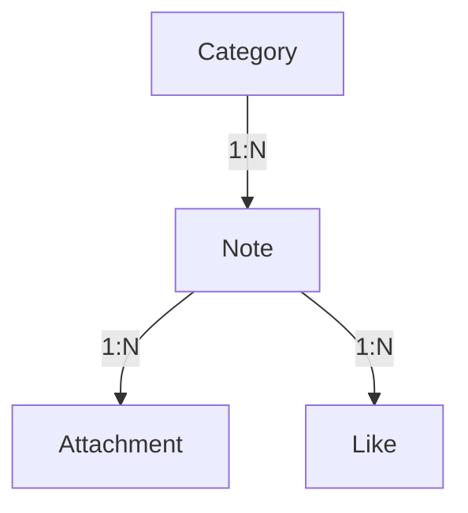

# Flask Notes Application - Summary

## Application Overview

I have successfully created a complete Flask notes application with the following features:

### ✅ Core Features Implemented

1. **Notes Management**
   - Create, read, update, and delete notes
   - Rich text content support
   - Timestamps for creation and updates

2. **Categories System**
   - Create, edit, and delete categories
   - Color-coded categories for visual organization
   - Category-based note filtering

3. **Attachments Support**
   - Upload multiple files per note
   - Supported formats: PNG, JPG, JPEG, GIF, PDF, TXT, DOC, DOCX
   - File management (view, download, delete)
   - Thumbnail previews for images

4. **Likes System**
   - Like functionality for notes
   - Like count display

5. **Multiple Views**
   - **Table View**: Traditional spreadsheet-style layout
   - **Keep View**: Google Keep-style card layout
   - Responsive design for both views

### 📁 Project Structure

```
flask_notes_app/
├── app.py                  # Main application file
├── requirements.txt        # Python dependencies
├── .env                    # Environment configuration
├── README.md               # User documentation
├── SUMMARY.md              # This file
├── test_app.py             # Test suite
├── run_app.sh              # Run script
├── static/                 # Static files (CSS, JS)
├── uploads/                # File uploads directory
├── templates/              # HTML templates
│   ├── base.html           # Base template
│   ├── notes_table.html    # Table view
│   ├── notes_keep.html     # Keep view
│   ├── create_note.html    # Create note form
│   ├── view_note.html      # View note details
│   ├── edit_note.html      # Edit note form
│   ├── categories.html     # Categories list
│   ├── create_category.html # Create category
│   └── edit_category.html  # Edit category
└── notes.db                # SQLite database (auto-created)
```

### 🚀 How to Run

**Option 1: Using the setup script (recommended)**

```bash
cd flask_notes_app
./setup_and_run.sh
```

This script will:
- Create a virtual environment automatically
- Install all dependencies
- Set up necessary directories
- Run the application

**Option 2: Manual setup**

1. **Create and activate virtual environment**:
   ```bash
   cd flask_notes_app
   python3 -m venv venv
   source venv/bin/activate  # On Windows: venv\Scripts\activate
   ```

2. **Install dependencies**:
   ```bash
   pip install -r requirements.txt
   ```

3. **Run the application**:
   ```bash
   python3 app.py
   ```

3. **Access the application**:
   - Open your browser to `http://localhost:5000`
   - The application will automatically create a default "General" category

### 🎯 Key Technical Features

- **Flask Framework**: Lightweight web framework
- **SQLAlchemy ORM**: Database management with SQLite
- **Bootstrap 5**: Responsive UI design
- **Font Awesome**: Icons for better UX
- **File Uploads**: Secure file handling with Werkzeug
- **Database Relationships**: Proper foreign keys and cascading deletes
- **Error Handling**: Flash messages for user feedback
- **Security**: CSRF protection, secure file uploads

### 📊 Database Schema



**Tables:**
- `categories`: id, name, color
- `notes`: id, title, content, created_at, updated_at, category_id
- `attachments`: id, filename, file_path, file_type, note_id, created_at
- `likes`: id, note_id, created_at

### 🎨 UI Features

- **Responsive Design**: Works on mobile, tablet, and desktop
- **Color Coding**: Categories have customizable colors
- **Visual Feedback**: Hover effects, animations, and flash messages
- **Intuitive Navigation**: Clear menu structure
- **File Previews**: Thumbnails for images, icons for documents

### 🔧 Customization Options

- **Categories**: Create unlimited categories with custom colors
- **Views**: Switch between table and card views
- **Attachments**: Upload various file types
- **Likes**: Mark favorite notes

### 🧪 Testing

The application includes a comprehensive test suite that verifies:
- Module imports
- Database connectivity and schema
- Route availability
- Basic functionality

### 📱 Responsive Design

- Mobile-friendly layout
- Adaptive card sizes
- Touch-friendly buttons
- Optimized for all screen sizes

### 🔒 Security Features

- CSRF protection via Flask
- Secure file uploads with filename sanitization
- File type validation
- Proper error handling
- Secure database operations

## Next Steps

The application is fully functional and ready to use. You can:

1. **Run it locally** for personal note-taking
2. **Deploy it** to a cloud service like Heroku, Render, or PythonAnywhere
3. **Extend it** with additional features (see Roadmap in README.md)
4. **Customize it** to match your branding or specific needs

## Deployment Notes

For production deployment:
- Change the `SECRET_KEY` in `.env`
- Consider using a production WSGI server like Gunicorn
- Set up proper file upload limits
- Implement backup strategy for the database and uploads
- Add user authentication for multi-user support

The application is ready to use and provides a solid foundation for a personal or small-team note-taking system!